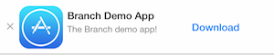
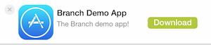
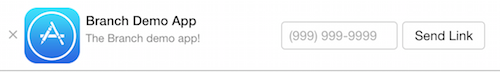

<!-- THIS FILE IS AUTOMATICALLY GENERATED. DO NOT EDIT; EDIT docs/1_intro.md INSTEAD -->
# Branch Web SDK

**[New documentation portal](https://dev.branch.io) and [support portal with user forums](http://support.branch.io)**.  This documentation outlines the functionality of the Branch Metrics Web SDK, and how to easily incorporate it into a web app.

Live demo: [https://cdn.branch.io/example.html](https://cdn.branch.io/example.html)

## Installation

### Requirements

This SDK requires only native browser Javascript and has been tested in all modern browsers with sessionStorage capability. No 3rd party libraries are needed to make use of the SDK as it is 100% native Javascript.

### Browser Specific Support

| Chrome | Firefox | Safari | IE |
|:--------:|:-------:|:--------:|:--------:|
| &#10004; |&#10004; | &#10004; | 9, 10, 11 |

#### Specific Browser Support Status

[](https://saucelabs.com/u/branchmetrics)

### Branch Key (formerly App ID)

You will need to create a [Branch Metrics app](http://branch.io) to obtain your Branch Key (you will have the option to toggle between live and test modes).

### Quick Install (Web SDK)

#### Manual installation

_Be sure to replace `BRANCH KEY` with your actual Branch Key found in your [account dashboard](https://dashboard.branch.io/#/settings)._

**[Formerly App ID](CHANGELOG.md)** Note that for the time being, initializing the Web SDK with an App ID will still work, it is strongly recomended you switch to using your live and test Branch Keys.

```html
<script type="text/javascript">
  (function(b,r,a,n,c,h,_,s,d,k){if(!b[n]||!b[n]._q){for(;s<_.length;)c(h,_[s++]);d=r.createElement(a);d.async=1;d.src="https://cdn.branch.io/branch-v1.8.1.min.js";k=r.getElementsByTagName(a)[0];k.parentNode.insertBefore(d,k);b[n]=h}})(window,document,"script","branch",function(b,r){b[r]=function(){b._q.push([r,arguments])}},{_q:[],_v:1},"addListener applyCode banner closeBanner creditHistory credits data deepview deepviewCta first getCode init link logout redeem referrals removeListener sendSMS setIdentity track validateCode".split(" "), 0);

	branch.init('BRANCH KEY', function(err, data) {
    	// callback to handle err or data
	});
</script>
```

#### Bower or npm installation

If you use Bower or npm, you can run `bower install branch-sdk` or `npm install branch-sdk` respectively to get the SDK.

#### Common.JS and RequireJS compatibility

In addition to working as a standalone library, the Branch SDK works great in CommonJS environments (browserify, webpack) as well as RequireJS environments (RequireJS/AMD). Just `require('branch')` or `define(['branch'], function(branch) { ... });` to get started!

#### Initialization and Event Handling

You should initialize the Branch SDK session once the 'deviceready' event fires and each time the 'resume' event fires.  See the example code below. You will need your Branch Key from the Branch dashboard.

```js
  branch.init("YOUR BRANCH KEY HERE", function(err, data) {
  	app.initComplete(err, data);
  });
```

The session close will be sent automatically on any 'pause' event.

### SDK Method Queue

Initializing the SDK is an asynchronous method with a callback, so it may seem as though you would need to place any method calls that will execute immediately inside the `branch.init()` callback. We've made it even easier than that, by building in a queue to the SDK! The only thing that is required is that `branch.init()` is called prior to any other methods. All SDK methods called are guaranteed to: 1. be executed in the order that they were called, and 2. wait to execute until the previous SDK method finishes. Therefore, it is 100% allowable to do something like:

```js
branch.init(...);
branch.banner(...);
```

If `branch.init()` fails, all subsequent branch methods will fail.

## API Reference

1. Branch Session
  + [.init()](#initbranch_key-options-callback)
  + [.data()](#datacallback)
  + [.first()](#firstcallback)
  + [.setIdentity()](#setidentityidentity-callback)
  + [.logout()](#logoutcallback)

2. Event Tracking
  + [.track()](#trackevent-metadata-callback)

3. Deep Linking
  + [.link()](#linkdata-callback)
  + [.sendSMS()](#sendsmsphone-linkdata-options-callback)
  + [.deepview()](#deepviewdata-options-callback)
  + [.deepviewCta()](#deepviewctacallback)

4. Referrals and Credits
  + [.referrals()](#referralscallback)
  + [.getCode()](#getcodeoptions-callback)
  + [.validateCode()](#validatecodecode-callback)
  + [.applyCode()](#applycodecode-callback)
  + [.credits()](#creditscallback)
  + [.creditHistory()](#credithistoryoptions-callback)
  + [.redeem()](#redeemamount-bucket-callback)

5. Event Listener
  + [.addListener()](#addlistenerevent-listener)
  + [.removeListener()](#removelistenerlistener)

6. Smart Banner
  + [.banner()](#banneroptions-data)

___


* * *

### init(branch_key, options, callback)

**Parameters**

**branch_key**: `string`, _required_ - Your Branch [live key](http://dashboard.branch.io/settings), or (depreciated) your app id.

**options**: `Object`, _optional_ - { *isReferrable*: _Is this a referrable session_ }.

**callback**: `function`, _optional_ - callback to read the session data.

THE "isReferrable" OPTION IS ONLY USED IN THE CORDOVA/PHONEGAP PLUGIN
AND THE TITANIUM MODULE

Adding the Branch script to your page automatically creates a window.branch
object with all the external methods described below. All calls made to
Branch methods are stored in a queue, so even if the SDK is not fully
instantiated, calls made to it will be queued in the order they were
originally called.
If the session was opened from a referring link, `data()` will also return the referring link click as `referring_link`, which gives you the ability to continue the click flow.

The init function on the Branch object initiates the Branch session and
creates a new user session, if it doesn't already exist, in
`sessionStorage`.

**Useful Tip**: The init function returns a data object where you can read
the link the user was referred by.

##### Usage
```js
branch.init(
    branch_key,
    options,
    callback (err, data),
);
```

##### Callback Format
```js
callback(
     "Error message",
     {
          data_parsed:        { },                          // If the user was referred from a link, and the link has associated data, the data is passed in here.
          referring_identity: '12345',                      // If the user was referred from a link, and the link was created by a user with an identity, that identity is here.
          has_app:            true,                         // Does the user have the app installed already?
          identity:           'BranchUser',                 // Unique string that identifies the user
          referring_link:          'https://bnc.lt/c/jgg75-Gjd3' // The referring link click, if available.
     }
);
```

**Note:** `Branch.init` must be called prior to calling any other Branch functions.
___


### data(callback)

**Parameters**

**callback**: `function`, _optional_ - callback to read the session data.

Returns the same session information and any referring data, as
`Branch.init`, but does not require the `app_id`. This is meant to be called
after `Branch.init` has been called if you need the session information at a
later point.
If the Branch session has already been initialized, the callback will return
immediately, otherwise, it will return once Branch has been initialized.
___


### first(callback)

**Parameters**

**callback**: `function`, _optional_ - callback to read the session data.

Returns the same session information and any referring data, as
`Branch.init` did when the app was first installed. This is meant to be called
after `Branch.init` has been called if you need the first session information at a
later point.
If the Branch session has already been initialized, the callback will return
immediately, otherwise, it will return once Branch has been initialized.

___


### setIdentity(identity, callback)

**Parameters**

**identity**: `string`, _required_ - a string uniquely identifying the user - often a user ID or email address.

**callback**: `function`, _optional_ - callback that returns the user's Branch identity id and unique link.

**[Formerly `identify()`](CHANGELOG.md)**

Sets the identity of a user and returns the data. To use this function, pass
a unique string that identifies the user - this could be an email address,
UUID, Facebook ID, etc.

##### Usage
```js
branch.setIdentity(
    identity,
    callback (err, data)
);
```

##### Callback Format
```js
callback(
     "Error message",
     {
          identity_id:             '12345', // Server-generated ID of the user identity, stored in `sessionStorage`.
          link:                    'url',   // New link to use (replaces old stored link), stored in `sessionStorage`.
          referring_data_parsed:    { },      // Returns the initial referring data for this identity, if exists, as a parsed object.
          referring_identity:      '12345'  // Returns the initial referring identity for this identity, if exists.
     }
);
```
___


### logout(callback)

**Parameters**

**callback**: `function`, _optional_

Logs out the current session, replaces session IDs and identity IDs.

##### Usage
```js
branch.logout(
    callback (err)
);
```

##### Callback Format
```js
callback(
     "Error message"
);
```
___


### track(event, metadata, callback)

**Parameters**

**event**: `string`, _required_ - name of the event to be tracked.

**metadata**: `Object`, _optional_ - object of event metadata.

**callback**: `function`, _optional_

This function allows you to track any event with supporting metadata. Use the events you track to create funnels in the Branch dashboard.
The `metadata` parameter is a formatted JSON object that can contain any data and has limitless hierarchy.

##### Usage
```js
branch.track(
    event,
    metadata,
    callback (err)
);
```

##### Callback Format
```js
callback("Error message");
```
___

# Deeplinking Methods

## Creating a deep linking link


### link(data, callback)

**Parameters**

**data**: `Object`, _required_ - link data and metadata.

**callback**: `function`, _required_ - returns a string of the Branch deep linking URL.

**[Formerly `createLink()`](CHANGELOG.md)**

Creates and returns a deep linking URL.  The `data` parameter can include an
object with optional data you would like to store, including Facebook
[Open Graph data](https://developers.facebook.com/docs/opengraph).

**data** The dictionary to embed with the link. Accessed as session or install parameters from the SDK.

**Note**
You can customize the Facebook OG tags of each URL if you want to dynamically share content by using the following optional keys in the data dictionary. Please use this [Facebook tool](https://developers.facebook.com/tools/debug/og/object) to debug your OG tags!

| Key | Value
| --- | ---
| "$og_title" | The title you'd like to appear for the link in social media
| "$og_description" | The description you'd like to appear for the link in social media
| "$og_image_url" | The URL for the image you'd like to appear for the link in social media
| "$og_video" | The URL for the video
| "$og_url" | The URL you'd like to appear
| "$og_redirect" | If you want to bypass our OG tags and use your own, use this key with the URL that contains your site's metadata.

Also, you can set custom redirection by inserting the following optional keys in the dictionary:

| Key | Value
| --- | ---
| "$desktop_url" | Where to send the user on a desktop or laptop. By default it is the Branch-hosted text-me service
| "$android_url" | The replacement URL for the Play Store to send the user if they don't have the app. _Only necessary if you want a mobile web splash_
| "$ios_url" | The replacement URL for the App Store to send the user if they don't have the app. _Only necessary if you want a mobile web splash_
| "$ipad_url" | Same as above but for iPad Store
| "$fire_url" | Same as above but for Amazon Fire Store
| "$blackberry_url" | Same as above but for Blackberry Store
| "$windows_phone_url" | Same as above but for Windows Store
| "$after_click_url" | When a user returns to the browser after going to the app, take them to this URL. _iOS only; Android coming soon_

You have the ability to control the direct deep linking of each link as well:

| Key | Value
| --- | ---
| "$deeplink_path" | The value of the deep link path that you'd like us to append to your URI. For example, you could specify "$deeplink_path": "radio/station/456" and we'll open the app with the URI "yourapp://radio/station/456?link_click_id=branch-identifier". This is primarily for supporting legacy deep linking infrastructure.
| "$always_deeplink" | true or false. (default is not to deep link first) This key can be specified to have our linking service force try to open the app, even if we're not sure the user has the app installed. If the app is not installed, we fall back to the respective app store or $platform_url key. By default, we only open the app if we've seen a user initiate a session in your app from a Branch link (has been cookied and deep linked by Branch).

#### Usage
```js
branch.link(
    data,
    callback (err, link)
);
```

#### Example
```js
branch.link({
    tags: [ 'tag1', 'tag2' ],
    channel: 'facebook',
    feature: 'dashboard',
    stage: 'new user',
    data: {
        mydata: 'something',
        foo: 'bar',
        '$desktop_url': 'http://myappwebsite.com',
        '$ios_url': 'http://myappwebsite.com/ios',
        '$ipad_url': 'http://myappwebsite.com/ipad',
        '$android_url': 'http://myappwebsite.com/android',
        '$og_app_id': '12345',
        '$og_title': 'My App',
        '$og_description': 'My app\'s description.',
        '$og_image_url': 'http://myappwebsite.com/image.png'
    }
}, function(err, link) {
    console.log(err, link);
});
```

##### Callback Format
```js
callback(
    "Error message",
    'https://bnc.lt/l/3HZMytU-BW' // Branch deep linking URL
);
```


### sendSMS(phone, linkData, options, callback)

**Parameters**

**phone**: `string`, _required_ - phone number to send SMS to

**linkData**: `Object`, _required_ - object of link data

**options**: `Object`, _optional_ - options: make_new_link, which forces the creation of a new link even if one already exists

**callback**: `function`, _optional_ - Returns an error if unsuccessful

**[Formerly `SMSLink()`](CHANGELOG.md)**

A robust function to give your users the ability to share links via SMS. If
the user navigated to this page via a Branch link, `sendSMS` will send that
same link. Otherwise, it will create a new link with the data provided in
the `params` argument. `sendSMS` also registers a click event with the
`channel` pre-filled with `'sms'` before sending an sms to the provided
`phone` parameter. This way the entire link click event is recorded starting
with the user sending an sms.

**Note**: `sendSMS` will *automatically* send a previously generated link click,
along with the `data` object in the original link. Therefore, it is unneccessary for the
`data()` method to be called to check for an already existing link. If a link already
exists, `sendSMS` will simply ignore the `data` object passed to it, and send the existing link.
If this behaivior is not desired, set `make_new_link: true` in the `options` object argument
of `sendSMS`, and `sendSMS` will always make a new link.

**Supports international SMS**.

#### Usage
```js
branch.sendSMS(
    phone,
    linkData,
    options,
    callback (err, data)
);
```

##### Example
```js
branch.sendSMS(
    '9999999999',
    {
        tags: ['tag1', 'tag2'],
        channel: 'facebook',
        feature: 'dashboard',
        stage: 'new user',
        data: {
            mydata: 'something',
            foo: 'bar',
            '$desktop_url': 'http://myappwebsite.com',
            '$ios_url': 'http://myappwebsite.com/ios',
            '$ipad_url': 'http://myappwebsite.com/ipad',
            '$android_url': 'http://myappwebsite.com/android',
            '$og_app_id': '12345',
            '$og_title': 'My App',
            '$og_description': 'My app\'s description.',
            '$og_image_url': 'http://myappwebsite.com/image.png'
        }
    },
    { make_new_link: true }, // Default: false. If set to true, sendSMS will generate a new link even if one already exists.
    function(err) { console.log(err); }
);
```

##### Callback Format
```js
callback("Error message");
```

___

## Deepview


### deepview(data, options, callback)

**Parameters**

**data**: `Object`, _required_ - object of all link data, same as Branch.link().

**options**: `Object`, _optional_ - { *make_new_link*: _whether to create a new link even if one already exists_, *open_app*, _whether to try to open the app immediately_ }.

**callback**: `function`, _optional_ - returns an error if unsuccessful

Register the current page view as a deepview, and inject Branch deepview CTA from the server.
The `data` parameter can include an object with optional data you would like to store, including
Facebook [Open Graph data](https://developers.facebook.com/docs/opengraph).

**data** The dictionary to embed with the link. Accessed as session or install parameters from the SDK.

**Note**
You can customize the Facebook OG tags of each URL if you want to dynamically share content by using the following optional keys in the data dictionary. Please use this [Facebook tool](https://developers.facebook.com/tools/debug/og/object) to debug your OG tags!

| Key | Value
| --- | ---
| "$og_title" | The title you'd like to appear for the link in social media
| "$og_description" | The description you'd like to appear for the link in social media
| "$og_image_url" | The URL for the image you'd like to appear for the link in social media
| "$og_video" | The URL for the video
| "$og_url" | The URL you'd like to appear
| "$og_redirect" | If you want to bypass our OG tags and use your own, use this key with the URL that contains your site's metadata.

Also, you can set custom redirection by inserting the following optional keys in the dictionary:

| Key | Value
| --- | ---
| "$desktop_url" | Where to send the user on a desktop or laptop. By default it is the Branch-hosted text-me service
| "$android_url" | The replacement URL for the Play Store to send the user if they don't have the app. _Only necessary if you want a mobile web splash_
| "$ios_url" | The replacement URL for the App Store to send the user if they don't have the app. _Only necessary if you want a mobile web splash_
| "$ipad_url" | Same as above but for iPad Store
| "$fire_url" | Same as above but for Amazon Fire Store
| "$blackberry_url" | Same as above but for Blackberry Store
| "$windows_phone_url" | Same as above but for Windows Store
| "$after_click_url" | When a user returns to the browser after going to the app, take them to this URL. _iOS only; Android coming soon_

You have the ability to control the direct deep linking of each link as well:

| Key | Value
| --- | ---
| "$deeplink_path" | The value of the deep link path that you'd like us to append to your URI. For example, you could specify "$deeplink_path": "radio/station/456" and we'll open the app with the URI "yourapp://radio/station/456?link_click_id=branch-identifier". This is primarily for supporting legacy deep linking infrastructure.

#### Usage
```js
branch.deepview(
    data,
    options,
    callback (err)
);
```

#### Example
```js
branch.deepview(
    {
        channel: 'facebook',
        data: {
            mydata: 'content of my data',
            foo: 'bar',
            '$desktop_url': 'https://en.wikipedia.org/wiki/Internet',
            '$ios_url': 'https://en.wikipedia.org/wiki/Internet',
            '$ipad_url': 'https://en.wikipedia.org/wiki/Internet',
            '$android_url': 'https://en.wikipedia.org/wiki/Internet',
            '$deepview_path': 'item_id=12345',
            '$og_app_id': '12345',
            '$og_title': 'My App',
            '$og_description': 'My app\'s description.'
        },
        feature: 'dashboard',
        stage: 'new user',
        tags: [ 'tag1', 'tag2' ],
    },
    {
        make_new_link: true,
        open_app: true
    },
    function(err) {
        console.log(err || 'no error');
    }
);
```

##### Callback Format
```js
callback(
    "Error message"
);
```


### Branch.deepviewCta

Perform the branch deepview CTA (call to action) on mobile. Namely, depends on how
*branch.deepview* is set up, the mobile users are redirected accordingly. If the deepview is
configured with the option *`open_app`* being true, an immediate attempt is made as soon as
deepview finishes, and thus the CTA is to visit the platform-appropriate app stores; if on the
other hand, the deepview is configured with the option *`open_app`* being false, the CTA is to
try to open app, and to visit the platform-appropriate app stores if the open-app attempt failes.

If *branch.deepview* has not been called, an error will arise with a reminder to call
*branch.deepview* first.

##### Usage
```js
&#x2F;&#x2F; If you&#39;re using jQuery, then:
$(&#39;a.deepview-cta&#39;).click(branch.deepviewCta);

&#x2F;&#x2F; Or you can:
document.getElementById(&#39;my-elem&#39;).onClick = branch.deepviewCta;

&#x2F;&#x2F; Or in HTML you can:
&lt;a href=&#39;...&#39; onclick=&#39;branch.deepviewCta()&#39;&gt;

&#x2F;&#x2F; If you wish to dedicate a CTA link only to branch deepviewCta, you can:
branch.deepview(data, option, function(err) {
    if (err) {
        throw err;
    }
    ${&#39;a.deepview-cta&#39;).click(branch.deepviewCta);
});

&#x2F;&#x2F; You can call this function any time after branch.deepview() is finished by simply:
branch.deepviewCta();
```
___

# Referral system rewarding functionality
In a standard referral system, you have 2 parties: the original user and the invitee. Our system is flexible enough to handle rewards for all users for any actions. Here are a couple example scenarios:
1. Reward the original user for taking action (eg. inviting, purchasing, etc)
2. Reward the invitee for installing the app from the original user&#39;s referral link
3. Reward the original user when the invitee takes action (eg. give the original user credit when their the invitee buys something)

These reward definitions are created on the dashboard, under the &#39;Reward Rules&#39; section in the &#39;Referrals&#39; tab on the dashboard.

Warning: For a referral program, you should not use unique awards for custom events and redeem pre-identify call. This can allow users to cheat the system.

## Retrieve referrals list()


### referrals(callback)

**Parameters**

**callback**: `function`, _required_ - returns an object with referral data.

**[Formerly `showReferrals()`](CHANGELOG.md)**

Retrieves a complete summary of the referrals the current user has made.

##### Usage
```js
branch.referrals(
    callback (err, data)
);
```

##### Callback Format
```js
callback(
    "Error message",
    {
        'install': {
             total: 5,
             unique: 2
        },
        'open': {
             total: 4,
             unique: 3
        },
        'buy': {
            total: 7,
            unique: 3
        }
    }
);
```

## Referral Codes


### getCode(options, callback)

**Parameters**

**options**: `Object`, _required_ - contins options for referral code creation.

**callback**: `function`, _optional_ - returns an error if unsuccessful

Create a referral code using the supplied parameters.  The code can be given to other users to enter.  Applying the code will add credits to the referrer, referree or both.
The `options` object can containt the following properties:

| Key | Value
| --- | ---
| amount | *reqruied* - An integer specifying the number of credits added when the code is applied.
| calculation_type | *required* - An integer of 1 for unlimited uses, or 0 for one use.
| location | *required* - An integer that determines who get's the credits:  0 for the referree, 2 for the referring user or 3 for both.
| bucket | *optional* - The bucket to apply the credits to.  Defaults to "default".
| prefix | *optional* - A string to be prepended to the code.
| expiration | *optional* - A date string that if present, determines the date on which the code expires.

##### Usage

branch.getCode(
    options,
    callback(err,data)
);

##### Example

```js
branch.getCode(
    {
      "amount":10,
      "bucket":"party",
      "calculation_type":1,
      "location":2
    },
    callback (err, data)
);
```

##### Callback Format
```js
callback(
     "Error message",
     {
       "referral_code":"AB12CD"
     }
);
```
___


### validateCode(code, callback)

**Parameters**

**code**: `string`, _required_ - the code string to validate.

**callback**: `function`, _optional_ - returns an error if unsuccessful

Validate a referral code before using.

##### Usage

```js
branch.validateCode(
    code, // The code to validate
    callback (err)
);
```

##### Example

```js
branch.validateCode(
    "AB12CD",
    function(err) {
        if (err) {
            console.log(err);
        }
        else {
            console.log("Code is valid");
        }
    }
);
```

##### Callback Format
```js
callback(
    "Error message",
    callback(err)
);
```
___


### applyCode(code, callback)

**Parameters**

**code**: `string`, _required_ - the code string to apply.

**callback**: `function`, _optional_ - returns an error if unsuccessful

Apply a referral code.

##### Usage

```js
branch.applyCode(
    code, // The code to apply
    callback (err)
);
```

##### Example

```js
branch.applyCode(
    "AB12CD",
    function(err) {
        if (err) {
            console.log(err);
        }
        else {
            console.log("Code applied");
        }
    }
);
```

##### Callback Format
```js
callback(
    "Error message",
    callback(err)
);
```
___

## Credit Functions


### credits(callback)

**Parameters**

**callback**: `function`, _required_ - returns an object with credit data.

**[Formerly `showCredits()`](CHANGELOG.md)**

This call will retrieve the entire history of credits and redemptions from the individual user.

##### Usage
```js
branch.credits(
    callback (err, data)
);
```

##### Callback Format
```js
callback(
    "Error message",
    {
        'default': 15,
        'other bucket': 9
    }
);
```


### creditHistory(options, callback)

**Parameters**

**options**: `Object`, _optional_ - options controlling the returned history.

**callback**: `function`, _required_ - returns an array with credit history data.

This call will retrieve the entire history of credits and redemptions from the individual user.
Properties available in the `options` object:

| Key | Value
| --- | ---
| bucket | *optional (max 63 characters)* - The bucket from which to retrieve credit transactions.
| begin_after_id | *optional* - The credit transaction id of the last item in the previous retrieval. Retrieval will start from the transaction next to it. If none is specified, retrieval starts from the very beginning in the transaction history, depending on the order.
| length | *optional* - The number of credit transactions to retrieve. If none is specified, up to 100 credit transactions will be retrieved.
| direction | *optional* - The order of credit transactions to retrieve. If direction is `1`, retrieval is in least recent first order; If direction is `0`, or if none is specified, retrieval is in most recent first order.

##### Usage

```js
branch.creditHistory(
     options,
     callback(err, data)
);
```

##### Example

```js
branch.creditHistory(
    {
      "length":50,
      "direction":0,
      "begin_after_id":"123456789012345",
      "bucket":"default"
    }
    callback (err, data)
);
```

##### Callback Format
```js
callback(
    "Error message",
[
    {
        "transaction": {
                           "date": "2014-10-14T01:54:40.425Z",
                           "id": "50388077461373184",
                           "bucket": "default",
                           "type": 0,
                           "amount": 5
                       },
        "referrer": "12345678",
        "referree": null
    },
    {
        "transaction": {
                           "date": "2014-10-14T01:55:09.474Z",
                           "id": "50388199301710081",
                           "bucket": "default",
                           "type": 2,
                           "amount": -3
                       },
        "referrer": null,
        "referree": "12345678"
    }
]
);
```

___

## Credit redemption


### redeem(amount, bucket, callback)

**Parameters**

**amount**: `number`, _required_ - an `amount` (int) of number of credits to redeem

**bucket**: `string`, _required_ - the name of the `bucket` (string) of which bucket to redeem the credits from

**callback**: `function`, _optional_ - returns an error if unsuccessful

**[Formerly `redeemCredits()`](CHANGELOG.md)**

Credits are stored in `buckets`, which you can define as points, currency, whatever makes sense for your app. When you want to redeem credits, call this method with the number of points to be redeemed, and the bucket to redeem them from.

```js
branch.redeem(
    amount, // Amount of credits to be redeemed
    bucket,  // String of bucket name to redeem credits from
    callback (err)
);
```

##### Example

```js
branch.redeem(
    5,
    "Rubies",
    function(err) {
        console.log(err);
    }
);
```

##### Callback Format
```js
callback("Error message");
```
___


### addListener(event, listener)

**Parameters**

**event**: `String`, _optional_ - Specify which events you would like to listen for. If not defined, the observer will recieve all events.

**listener**: `function`, _required_ - Listeneing function that will recieves an event as a string.

The Branch Web SDK includes a simple event listener, that currently only publishes events for `Branch.banner()` events.
Future development will include the ability to subscribe to events related to all other Web SDK functionality.

##### Example

```
var listener = function(event) { console.log(event); }

// Specify an event to listen for
branch.addListener('willShowBanner', listener);

// Listen for all events
branch.addListener(listener);
```

#### Available `Branch.banner()` Events:
- *willShowBanner*: `banner()` called, and the smart banner is about to be shown.
- *willNotShowBanner*: `banner()` called, and the smart banner will not be shown. No more events will be emitted.
- *didShowBanner*: Smart banner animation started and was is being shown to the user.
- *willCloseBanner*: `closeBanner()` called, and the smart banner will close.
- *didCloseBanner*: Smart banner close animation started, and is closing.
- *willSendBannerSMS*: Phone number in correct format, and will attempt to send SMS.
- *sendBannerSMSError*: `sendSMS()` error returned.
- *didSendBannerSMS*: SMS successfully sent.
- *didDownloadApp*: User installed app, and banner text updated.


### removeListener(listener)

**Parameters**

**listener**: `function`, _required_ - Reference to the listening function you would like to remove. *note*: this must be the same reference that was passed to `branch.addListener()`, not an identical clone of the function.

Remove the listener from observations, if it is present. Not that this function must be passed a referrence to the _same_ function that was passed to `branch.addListener()`, not just an identical clone of the function.


### banner(options, data)

**Parameters**

**options**: `Object`, _required_ - object of all the options to setup the banner

**data**: `Object`, _required_ - object of all link data, same as Branch.link()

**[Formerly `appBanner()`](CHANGELOG.md)**

Display a smart banner directing the user to your app through a Branch referral link.  The `data` param is the exact same as in `branch.link()`.

*Be sure to checkout the [Smart Banner Guide](SMART_BANNER_GUIDE.md) for a full explanation of everything you can do!*

| iOS Smart Banner | Android Smart Banner | Desktop Smart Banner |
|------------------|----------------------|----------------------|
|  |  |  |

#### Usage

```js
branch.banner(
    options, // Banner options: See example for all available options
    data // Data for link, same as Branch.link()
);
```

##### Example

```js
branch.banner({
    icon: 'http://icons.iconarchive.com/icons/wineass/ios7-redesign/512/Appstore-icon.png',
    title: 'Branch Demo App',
    description: 'The Branch demo app!',
    openAppButtonText: 'Open',              // Text to show on button if the user has the app installed
    downloadAppButtonText: 'Download',      // Text to show on button if the user does not have the app installed
    sendLinkText: 'Send Link',              // Text to show on desktop button to allow users to text themselves the app
    phonePreviewText: '+44 9999-9999',      // The default phone placeholder is a US format number, localize the placeholder number with a custom placeholder with this option
    showiOS: true,                          // Should the banner be shown on iOS devices (both iPhones and iPads)?
    showiPad: true,                         // Should the banner be shown on iPads (this overrides showiOS)?
    showAndroid: true,                      // Should the banner be shown on Android devices?
    showBlackberry: true,                   // Should the banner be shown on Blackberry devices?
    showWindowsPhone: true,                 // Should the banner be shown on Windows Phone devices?
    showKindle: true,                       // Should the banner be shown on Kindle devices?
    showDesktop: true,                      // Should the banner be shown on desktop devices?
    iframe: true,                           // Show banner in an iframe, recomended to isolate Branch banner CSS
    disableHide: false,                     // Should the user have the ability to hide the banner? (show's X on left side)
    forgetHide: false,                      // Should we show the banner after the user closes it? Can be set to true, or an integer to show again after X days
    position: 'top',                        // Sets the position of the banner, options are: 'top' or 'bottom', and the default is 'top'
    mobileSticky: false,                    // Determines whether the mobile banner will be set `position: fixed;` (sticky) or `position: absolute;`, defaults to false *this property only applies when the banner position is 'top'
    desktopSticky: true,                    // Determines whether the desktop banner will be set `position: fixed;` (sticky) or `position: absolute;`, defaults to true *this property only applies when the banner position is 'top'
    customCSS: '.title { color: #F00; }',   // Add your own custom styles to the banner that load last, and are gauranteed to take precedence, even if you leave the banner in an iframe
    make_new_link: false,                   // Should the banner create a new link, even if a link already exists?
    open_app: false,                        // Should the banner try to open the app immediately on load?

}, {
    tags: ['tag1', 'tag2'],
    feature: 'dashboard',
    stage: 'new user',
    data: {
        mydata: 'something',
        foo: 'bar',
        '$desktop_url': 'http://myappwebsite.com',
        '$ios_url': 'http://myappwebsite.com/ios',
        '$ipad_url': 'http://myappwebsite.com/ipad',
        '$android_url': 'http://myappwebsite.com/android',
        '$og_app_id': '12345',
        '$og_title': 'My App',
        '$og_description': 'My app\'s description.',
        '$og_image_url': 'http://myappwebsite.com/image.png'
    }
});
```
___

### closeBanner()

#### Closing the App Banner Programmatically

The App Banner includes a close button the user can click, but you may want to close the banner with a timeout, or via some
other user interaction with your web app. In this case, closing the banner is very simple by calling `Branch.closeBanner()`.

##### Usage
```js
branch.closeBanner();
```


* * *


## Bugs / Help / Support

Feel free to report any bugs you might encounter in the repo's issues. Any support inquiries outside of bugs
please send to [support@branch.io](mailto:support@branch.io).
